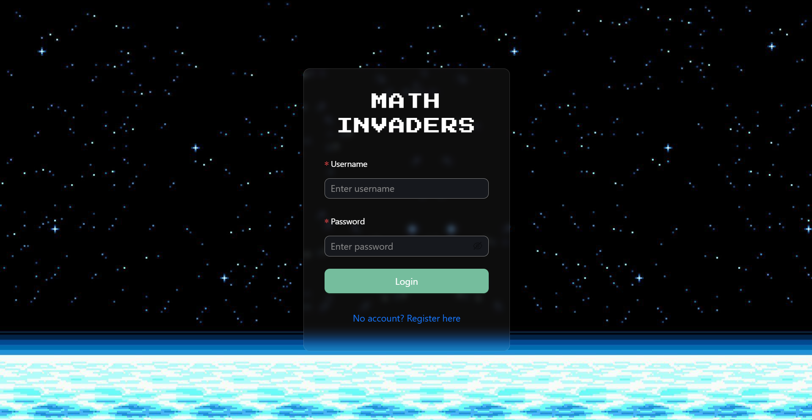
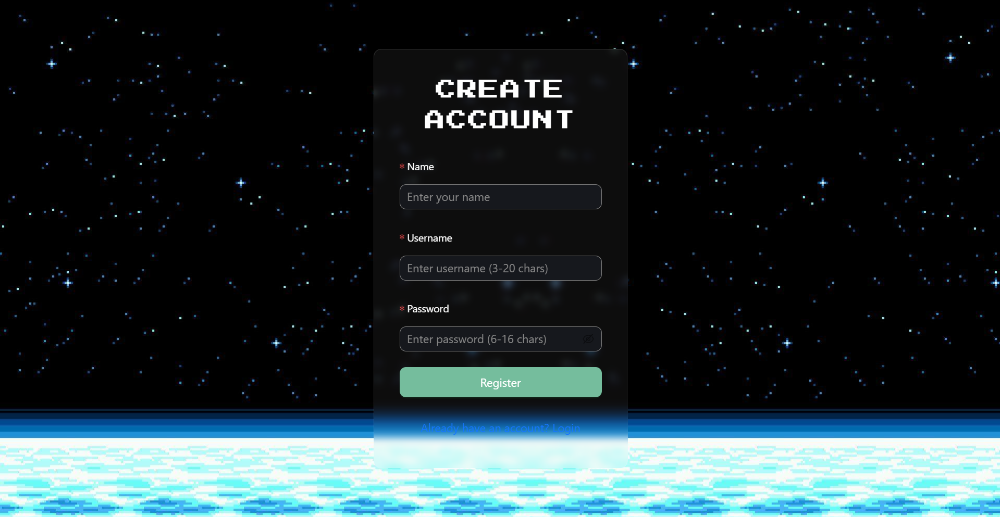
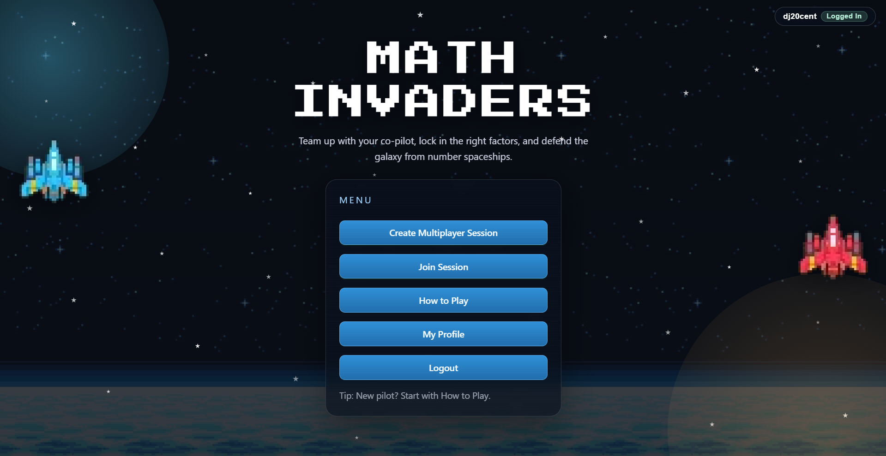
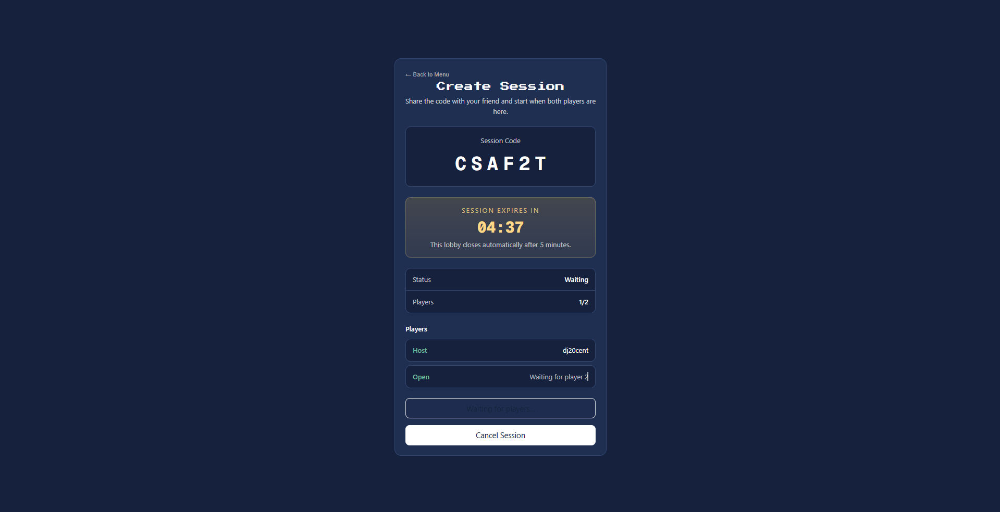
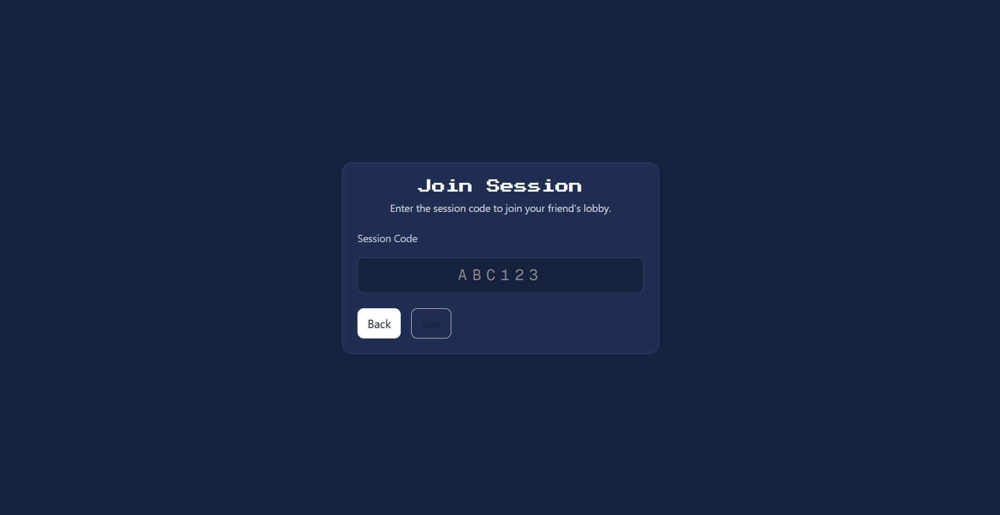
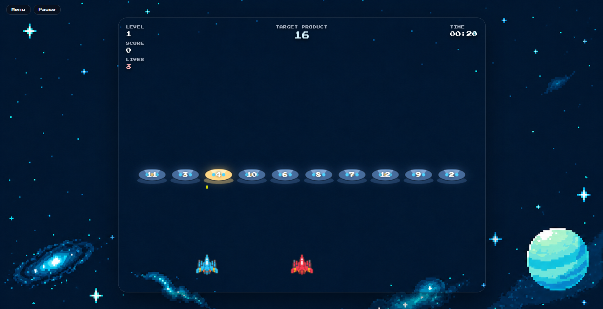
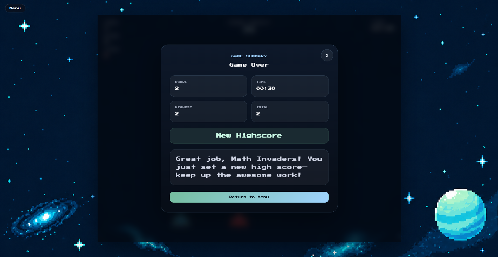
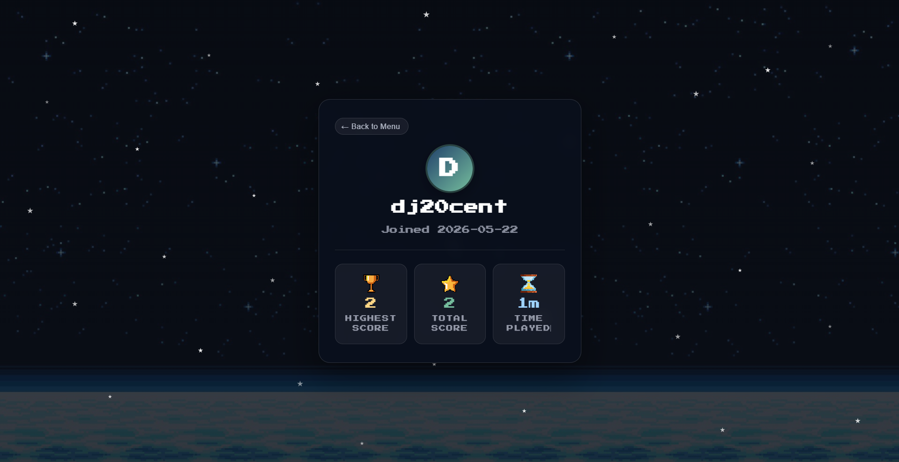

# Math Invaders Client

## Introduction

Math Invaders is a cooperative multiplayer learning game where two players practice multiplication in a realtime space-shooter setting. Players create or join a session, control spaceships, shoot falling number blocks, and clear levels by selecting the correct factor pairs for a displayed target product.

This repository contains the frontend of the application. It is responsible for the user interface, authentication flow, multiplayer lobby screens, canvas-based gameplay, frontend problem generation, and communication with the backend REST and WebSocket APIs.

## Technologies

- Next.js with React and TypeScript
- Ant Design for UI components
- HTML Canvas for gameplay rendering
- STOMP over SockJS for realtime multiplayer communication
- Jest for frontend tests
- Deno or npm for local development
- Docker for deployment

## High-Level Components

### 1. Routing and Page Structure

The application uses the Next.js app router. The main user flows are implemented as pages under [`app`](./app):

- [`app/page.tsx`](./app/page.tsx): redirects users to the login page.
- [`app/login/page.tsx`](./app/login/page.tsx): handles login and stores the user session.
- [`app/register/page.tsx`](./app/register/page.tsx): allows new users to create an account.
- [`app/menu/page.tsx`](./app/menu/page.tsx): provides the main navigation after login.
- [`app/session/create/page.tsx`](./app/session/create/page.tsx): creates a multiplayer session.
- [`app/session/join/page.tsx`](./app/session/join/page.tsx): lets a second player join by entering a session code.
- [`app/play_test/page.tsx`](./app/play_test/page.tsx): contains the main game screen.

These pages are connected through the main user flow: login or register, enter the menu, create or join a session, then play the game.

### 2. API Communication

The file [`app/api/apiService.ts`](./app/api/apiService.ts) contains the reusable API service used by the frontend. It wraps `fetch` and provides methods for `GET`, `POST`, `PUT`, and `DELETE` requests.

The backend URL is configured in [`app/utils/domain.ts`](./app/utils/domain.ts). In development, the client uses `NEXT_PUBLIC_DEV_API_URL` or falls back to `http://localhost:8080`. In production, it uses `NEXT_PUBLIC_PROD_API_URL` or the configured deployed backend URL.

### 3. Authentication and User State

Authentication data is stored in the browser and accessed through:

- [`app/utils/authStorage.ts`](./app/utils/authStorage.ts)
- [`app/hooks/useLocalStorage.tsx`](./app/hooks/useLocalStorage.tsx)
- [`app/hooks/useAuthGuard.ts`](./app/hooks/useAuthGuard.ts)

After login, the frontend stores the token, user id, and username. Protected pages use the auth guard to redirect unauthenticated users back to `/login`.

The profile page is implemented in [`app/profile/page.tsx`](./app/profile/page.tsx). It displays user statistics such as highest score, total score, and time played.

### 4. Multiplayer Session Flow

The multiplayer lobby flow is implemented in:

- [`app/session/create/page.tsx`](./app/session/create/page.tsx): creates a session, displays a six-character code, shows the players, and lets the host start the game.
- [`app/session/join/page.tsx`](./app/session/join/page.tsx): validates and submits a session code.
- [`app/session/waiting/page.tsx`](./app/session/waiting/page.tsx): shows the waiting state until the host starts the game.

These pages communicate with the backend session endpoints and poll the session state so both players enter the game once the session becomes active.

### 5. Gameplay and Realtime Updates

The main game logic is implemented in [`app/play_test/page.tsx`](./app/play_test/page.tsx). It renders the game with HTML Canvas, handles keyboard input, moves ships, draws bullets and falling number blocks, and displays score, lives, target product, and elapsed time.

Supporting files include:

- [`app/hooks/useWebSocket.ts`](./app/hooks/useWebSocket.ts): connects to the backend WebSocket endpoint and sends realtime movement, shooting, pause, resume, and game-state messages.
- [`app/utils/mathProblems.ts`](./app/utils/mathProblems.ts): generates and normalizes multiplication problems.
- [`app/utils/gameObject/ship.ts`](./app/utils/gameObject/ship.ts): represents player ships.
- [`app/utils/gameObject/bullet.ts`](./app/utils/gameObject/bullet.ts): represents bullets.
- [`app/utils/gameObject/gameBlockObject.ts`](./app/utils/gameObject/gameBlockObject.ts): represents falling number blocks.
- [`app/play_test/GameSummaryOverlay.tsx`](./app/play_test/GameSummaryOverlay.tsx): displays the final score, time, highscore information, and feedback after a game.

## Launch & Deployment

### Prerequisites

Install Node.js/npm or Deno. The backend server should also be running locally on port `8080` for the full application flow.

### Local Setup

Clone the repository:

```bash
git clone https://github.com/duracell04/sopra-fs26-group-42-client.git
cd sopra-fs26-group-42-client
```

Install dependencies:

```bash
npm install
```

Optionally configure the backend URL:

```bash
NEXT_PUBLIC_DEV_API_URL=http://localhost:8080
NEXT_PUBLIC_PROD_API_URL=https://sopra-fs26-group-42-server.oa.r.appspot.com
```

### Run Locally

Start the development server:

```bash
npm run dev
```

The frontend is available at:

```text
http://localhost:3000
```

### Build and Run Production Version

Build the application:

```bash
npm run build
```

Start the production build:

```bash
npm run start
```

### Tests and Code Quality

Run tests:

```bash
npm run test
```

Run linting:

```bash
npm run lint
```

Format the code:

```bash
npm run fmt
```

The same commands can also be run with Deno by replacing `npm run` with `deno task`, for example:

```bash
deno task dev
```

### Docker Deployment

Build the Docker image:

```bash
docker build -t math-invaders-client .
```

Run the container:

```bash
docker run -p 3000:3000 math-invaders-client
```

For releases, the main branch can be connected to DockerHub through GitHub Actions. The required repository secrets are:

- `dockerhub_username`
- `dockerhub_password`
- `dockerhub_repo_name`

After the image is published, it can be pulled and run with:

```bash
docker pull <dockerhub_username>/<dockerhub_repo_name>
docker run -p 3000:3000 <dockerhub_username>/<dockerhub_repo_name>
```

## Illustrations

The following screenshots should be added once the final application screenshots are available.

### Login and Registration

Users can create an account or log in with an existing account. After a successful login, the user is redirected to the main menu.




### Main Menu

The main menu lets users create a multiplayer session, join an existing session, open the how-to-play page, view their profile, or log out.



### Multiplayer Lobby

The host creates a session and shares the generated code. The second player enters this code to join the lobby. Once both players are present, the host can start the game.




### Gameplay

During gameplay, both players control spaceships, shoot falling number blocks, and try to select the correct factor pairs for the displayed target product.



### Game Summary and Profile

After a game, the application shows the final score, elapsed time, feedback, and highscore information. The profile page displays long-term user statistics.




## Roadmap

Future contributors could add:

1. A matchmaking mode so players can join available public sessions without manually sharing a code.
2. Difficulty levels with different multiplication ranges, speeds, and number of levels.
3. Persistent leaderboards and achievements to make long-term progress more visible.

## Authors and Acknowledgment

This project was developed for the Software Engineering Lab at the University of Zurich by Group 42.

Team members:

- Remy Klemenz
- Enrique Georg Zbinden
- Siyang Jiang
- Csaba Vizhanyo
- Attila Vizhanyo

We acknowledge the University of Zurich SoPra teaching team for the project template, deployment setup, and course guidance.

## License

This project is licensed under the Apache License 2.0. If this repository does not yet contain a `LICENSE` file, add the same Apache 2.0 license file used by the server repository.